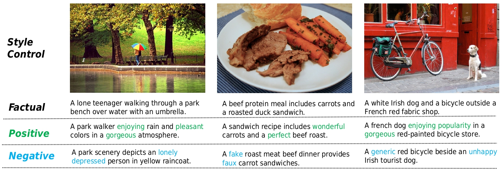

# ConZIC
**[CVPR 2023][ConZIC: Controllable Zero-shot Image Captioning by Sampling-Based Polishing](https://arxiv.org/abs/2303.02437)**
<br/>
[Zequn Zeng](https://joeyz0z.github.io/),
[Hao Zhang](https://scholar.google.com/citations?user=Eo8e5icAAAAJ),
[Zhengjue Wang](https://scholar.google.com/citations?user=qTQj_I4AAAAJ),
[Ruiying Lu](https://ieeexplore.ieee.org/author/37088439713),
[Dongsheng Wang](https://wds2014.github.io/),
[Bo Chen](https://scholar.google.com/citations?user=uv16_-UAAAAJ)
<br/>


[comment]: <> ([![Project Website]&#40;https://img.shields.io/badge/Project-Website-orange&#41;]&#40;https://tuneavideo.github.io/&#41;)
[](https://arxiv.org/abs/2303.02437)
[](https://huggingface.co/spaces/jiaqingj/ConZIC)
[](https://colab.research.google.com/drive/1MyjEAuygQblYwTjK67ATo7XALuHkkiLa?usp=sharing)

### News
* [2023/4] Adding demo on Huggingface Space and Colab!
* [2023/3] ConZIC is publicly released!

***
### Framework


#### Gibbs-BERT


#### Example of sentiment control



## DEMO

### Preparation
Please download [CLIP](https://huggingface.co/openai/clip-vit-base-patch32) and [BERT](https://huggingface.co/bert-base-uncased) from Huggingface Space.

SketchyCOCOcaption benchmark in our work is available [here](https://drive.google.com/file/d/1WBaq8OdvyyXpbYtmuFIvko6855rESwHE/view?usp=share_link).

Environments setup.
```
pip install -r requirements.txt
```

### To run zero-shot captioning on images:
ConZIC supports arbitary generation orders by change **order**. You can increase **alpha** for more fluency, **beta** for more image content. Notably, there is a trade-off between fluency and image-matching degree.  
**Sequential**: update tokens in classical left to right order. At each iteration, the whole sentence will be updated.
```
python demo.py --run_type "caption" --order "sequential" --sentence_len 10 --caption_img_path "./examples/girl.jpg" --samples_num 1
--lm_model "bert-base-uncased" --match_model "openai/clip-vit-base-patch32" 
--alpha 0.02 --beta 2.0
```
**Shuffled**: update tokens in random shuffled generation order, different orders resulting in different captions.
```
python demo.py --run_type "caption" --order "shuffle" --sentence_len 10 --caption_img_path "./examples/girl.jpg" --samples_num 3
--lm_model "bert-base-uncased" --match_model "openai/clip-vit-base-patch32" 
--alpha 0.02 --beta 2.0 
```
**Random**: only randomly select a position and then update this token at each iteration, high diversity due to high randomness. 
```
python demo.py --run_type "caption" --order "random" --sentence_len 10 --caption_img_path "./examples/girl.jpg" --samples_num 3
--lm_model "bert-base-uncased" --match_model "openai/clip-vit-base-patch32" 
--alpha 0.02 --beta 2.0
```

### To run controllable zero-shot captioning on images:
ConZIC supports many text-related controllable signals. For examples:  
**Sentiments(positive/negative)**: you can increase **gamma** for higher controllable degree, there is also a trade-off.
```
python demo.py 
--run_type "controllable" --control_type "sentiment" --sentiment_type "positive"
--order "sequential" --sentence_len 10 --caption_img_path "./examples/girl.jpg" --samples_num 1
--lm_model "bert-base-uncased" --match_model "openai/clip-vit-base-patch32" 
--alpha 0.02 --beta 2.0 --gamma 5.0
```
**Part-of-speech(POS)**: it will meet the predefined POS templete as much as possible.
```
python demo.py 
--run_type "controllable" --control_type "pos" --order "sequential"
--pos_type "your predefined POS templete"
--sentence_len 10 --caption_img_path "./examples/girl.jpg"  --samples_num 1
--lm_model "bert-base-uncased" --match_model "openai/clip-vit-base-patch32" 
--alpha 0.02 --beta 2.0 --gamma 5.0
```
**Length**: change **sentence_len**.

## Gradio Demo
We highly recommend to use the following **WebUI** demo in your browser from the local url: http://127.0.0.1:7860.
```
pip install gradio
python app.py --lm_model "bert-base-uncased" --match_model "openai/clip-vit-base-patch32" 
```
You can also use the **demo.launch()** function to create a public link used by anyone to access the demo from their browser by setting share=True.

****
### Citation
Please cite our work if you use it in your research:
```
@article{zeng2023conzic,
  title={ConZIC: Controllable Zero-shot Image Captioning by Sampling-Based Polishing},
  author={Zeng, Zequn and Zhang, Hao and Wang, Zhengjue and Lu, Ruiying and Wang, Dongsheng and Chen, Bo},
  journal={arXiv preprint arXiv:2303.02437},
  year={2023}
}
```

### Contact
If you have any questions, please contact zzequn99@163.com or zhanghao_xidian@163.com.


### Acknowledgment 
This code is based on the [bert-gen](https://github.com/nyu-dl/bert-gen) and [MAGIC](https://github.com/yxuansu/MAGIC). 

Thanks for [Jiaqing Jiang](https://github.com/blre6) providing huggingface and Colab demo.


