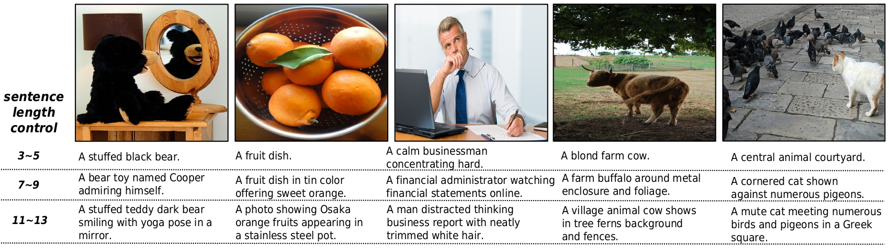
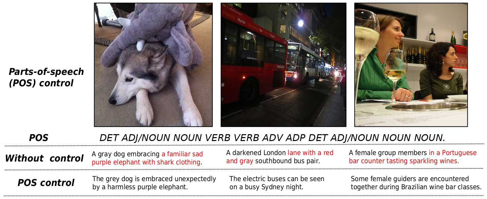
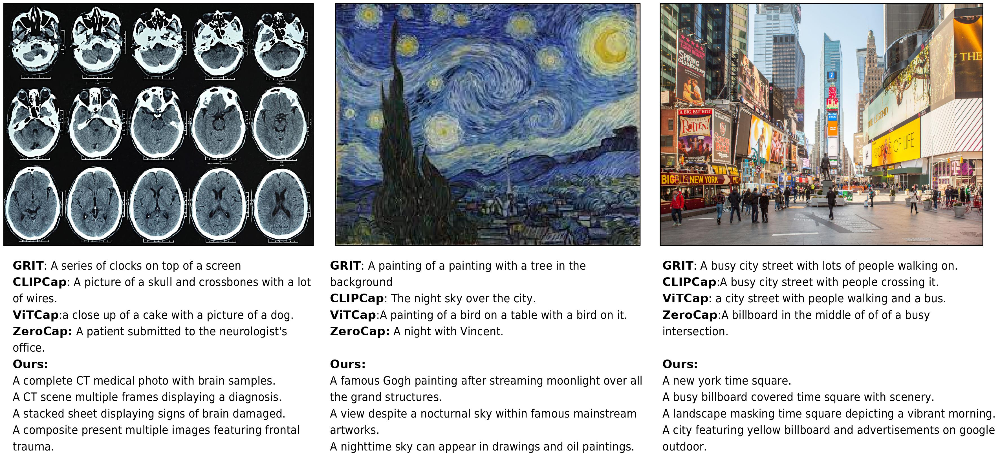

# Pytorch Implementation of [ConZIC: Controllable Zero-shot Image Captioning by Sampling-Based Polishing](https://arxiv.org/abs/2303.02437) [CVPR 2023]

## Framework


## Example of length control


## Example of sentiment control


## Example of part-of-speech control


## Example of diverse captioning


## Example of various image styles with world knowledge



## DEMO

### To run zero-shot captioning on images:
ConZIC supports arbitary generation orders by change **order**. You can increase **alpha** for more fluency, **beta** for more image content. Notably, there is a trade-off between fluency and image-matching degree.  
**Sequential**: update tokens in classical left to right order. At each iteration, the whole sentence will be updated.
```
python run.py --run_type "caption" --order "sequential" --sentence_len 10 --caption_img_path "./examples" 
--lm_model "bert-base-uncased" --match_model "clip-vit-base-patch32" 
--alpha 0.02 --beta 2.0
```
**Shuffled**: update tokens in random shuffled generation order, different orders resulting in different captions.
```
python run.py --run_type "caption" --order "shuffle" --sentence_len 10 --caption_img_path "./examples" 
--lm_model "bert-base-uncased" --match_model "clip-vit-base-patch32" 
--alpha 0.02 --beta 2.0
```
**Random**: only randomly select a position and then update this token at each iteration, high diversity due to high randomness. 
```
python run.py --run_type "caption" --order "random" --sentence_len 10 --caption_img_path "./examples" 
--lm_model "bert-base-uncased" --match_model "clip-vit-base-patch32" 
--alpha 0.02 --beta 2.0
```

### To run controllable zero-shot captioning on images:
ConZIC supports many text-related controllable signals. For examples:  
**Sentiments(positive/negative)**: you can increase **gamma** for higher controllable degree, there is also a trade-off.
```
python run.py 
--run_type "controllable" --control_type "sentiment" --sentiment_type "positive"
--order "sequential" --sentence_len 10 --caption_img_path "./examples" 
--lm_model "bert-base-uncased" --match_model "clip-vit-base-patch32" 
--alpha 0.02 --beta 2.0 --gamma 5.0
```
**Part-of-speech(POS)**: it will meet the predefined POS templete as much as possible.
```
python run.py 
--run_type "controllable" --control_type "pos" --order "sequential"
--pos_type "your predefined POS templete"
--sentence_len 10 --caption_img_path "./examples" 
--lm_model "bert-base-uncased" --match_model "clip-vit-base-patch32" 
--alpha 0.02 --beta 2.0 --gamma 5.0
```
Length: change **sentence_len**.


**Acknowledgment:** This code is based on the [bert-gen](https://github.com/nyu-dl/bert-gen) and [MAGIC](https://github.com/yxuansu/MAGIC). 


